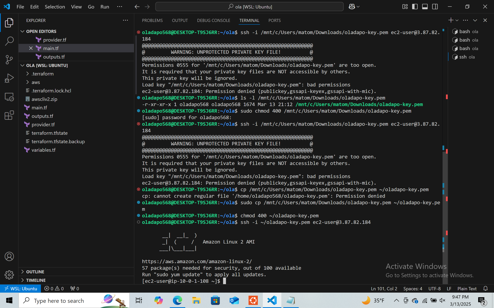

# Terraform 2-Tier Web App on AWS

This project demonstrates how I deployed a 2-tier architecture (VPC, subnets, security group, and EC2 instance) using **Terraform** on **AWS**. It includes the setup, Terraform configuration, encountered challenges, and solutions.

---

## 📁 Project Structure

The project is organized using separate Terraform configuration files:

---

## 🛠️ Tools Used

- **Terraform**
- **AWS CLI**
- **Visual Studio Code** with **WSL (Ubuntu)** on Windows

---

## 🚀 Step-by-Step Guide

### 1. Installed Visual Studio Code and Launched WSL

---

### 2. Created Project Folder and Files

---

### 3. Provider Configuration

---

### 4. Configured AWS CLI

---

### 5. Installed AWS CLI and Terraform

---

### 6. Initialized Terraform

---

### 7. Created Network Resources

---

### 8. Created EC2 Instance and Security Group

---

### 9. Terraform Apply

---

### 10. Verified EC2 Instance on AWS Console

---

### 11. Connected to EC2 via SSH and Installed Web Server

---

### 12. Output Public IP via Terraform

---

### 13. Updated EC2 Resource with Key Name

---

### ✅ Final Test

---

## ⚠️ Problems I Faced & Solutions

| Problem | Solution |
|--------|----------|
| Terraform GitHub push permission denied to wrong user | I updated my GitHub config to use the correct email/account |
| SSH key permissions too open | Ran `chmod 400 my-key.pem` to restrict access |
| EC2 connection failed initially | Fixed by adding correct key name to EC2 resource and security group rule |
| Apache page not loading | Ensured Security Group allowed HTTP (port 80) & EC2 had public IP |

---

## 💡 Lessons Learned

- Always verify your AWS credentials and Terraform backend before deployment.
- Managing infrastructure as code makes cloud resource provisioning repeatable and scalable.
- EC2 security requires both correct permissions and network config (VPC, routes, security group).

---

## 🙌 Author

**Oladapo Adenekan**  
LinkedIn: [www.linkedin.com/in/oladapo568](https://www.linkedin.com/in/oladapo568)

---

